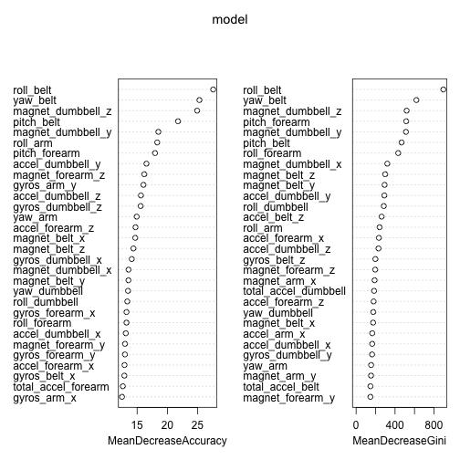

Practical Machine Learning: Prediction Assignment
========================================================

#### In this project, we use data from accelerometers on the belt, forearm, arm, and dumbell of 6 participants, who were asked to perform barbell lifts correctly and incorrectly in 5 different ways. For more information, please visit: http://groupware.les.inf.puc-rio.br/har.  

### Getting and Cleaning the Data
The training data for this project are available here: https://d396qusza40orc.cloudfront.net/predmachlearn/pml-training.csv

The test data are available here: https://d396qusza40orc.cloudfront.net/predmachlearn/pml-testing.csv

We load the training and testing data sets directly from their source and assign "NA" value to missing values:

```r
trainInt <- "http://d396qusza40orc.cloudfront.net/predmachlearn/pml-training.csv"
testInt <- "http://d396qusza40orc.cloudfront.net/predmachlearn/pml-testing.csv"
train <- read.csv(url(trainInt), na.strings=c("NA",""))
test <- read.csv(url(testInt), na.strings=c("NA",""))
```

We assume that variables with a lot of missing observations will not be very usefull for the analysis. Therefore, we remove all variables that contain "NA" values.

```r
test  <- test[ , colSums(is.na(train)) == 0]
train <- train[ , colSums(is.na(train)) == 0]
```

We also remove variables that should be irrelevant, i.e. observation label, user info, time/date and undefined. These correspond to the first seven features.

```r
train <- train[,-c(1:7)]
test <- test[,-c(1:7)]
```

We shall now split the "train" data set into two subsets. One for training and one for cross validation. The training set consists of the 70% of the data while the cross-validation set consists of the remaining 30%.

```r
library(lattice)
library(ggplot2)
library(caret)
set.seed(1)
forTrain <- createDataPartition(y=train$classe, p=0.7, list=FALSE)
train <- train[forTrain,]
crossValidation <- train[-forTrain,]
```

### Random-forest classification model
We now built a prediction model to solve our classification problem. In particular, we shall use random forest with 100 trees. 

```r
library(randomForest)
```

```
## randomForest 4.6-12
## Type rfNews() to see new features/changes/bug fixes.
```

```r
model <- randomForest(classe ~ ., data=train, ntree=100, importance=TRUE)
```

### Variable importance
We can see wich variables are more important for the creation of the model, using the "varImpPlot" function.

```r
varImpPlot(model)
```

 

### Cross Validation
Using the cross-validation set, we evaluate the performance of our model. In the overall statistics bellow, we see that the accuracy of our model is 1. This means that the model predicted all cases in the cross-validation set correctly!

```r
pred <- predict(model, crossValidation)
confus <- confusionMatrix(crossValidation$classe, pred)
accuracy <- confus$overall[1]
accuracy
```

```
## Accuracy 
##        1
```

### Out-of-sample Error
The out-of-sample error is estimated to be 0, since the accuracy is 1.

```r
outOfSample <- 1 - accuracy
as.numeric(outOfSample)
```

```
## [1] 0
```

### Conclusion
Given the high accuracy of our model, we are comfident that it predicts correclty every case in the "test" set.

```r
predTest <- predict(model, test)
predTest
```

```
##  1  2  3  4  5  6  7  8  9 10 11 12 13 14 15 16 17 18 19 20 
##  B  A  B  A  A  E  D  B  A  A  B  C  B  A  E  E  A  B  B  B 
## Levels: A B C D E
```
